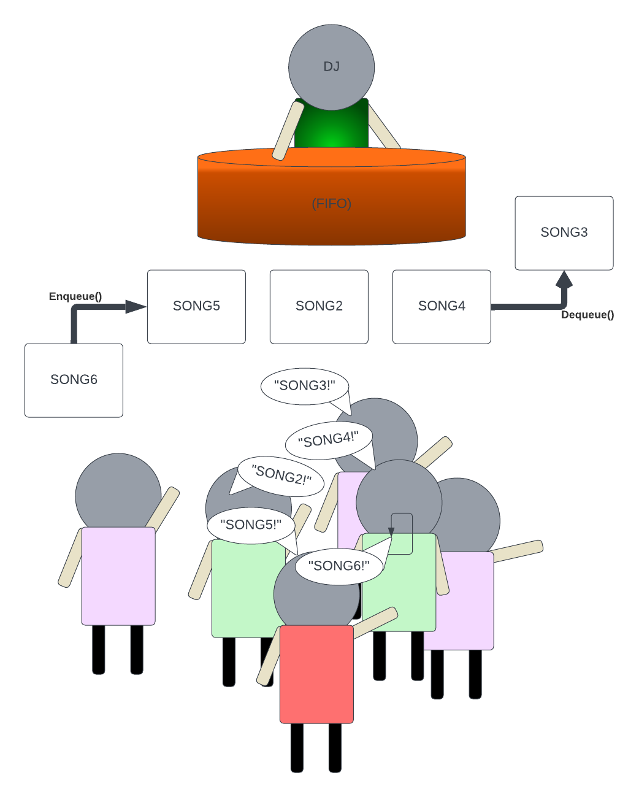

## Power of Data Structures : Queues
### Welcome to Queues : Tutorial

- [Welcome](0-welcome.md)
- [Linked List](2-Linked-List.md)
- [Tree](3-Tree.md)
- [Demo video COMMING SOON]<!-- add youtube link for Queue tutorial -->

# II. Queue: Creating a Playlist

## Introduction to Queues
Imagine you are hosting a party, and you want to accommodate all the song requests from the attendees. 
    As song suggestions pour in, you need an efficient way to manage and prioritize who's requests to play next. 
    This is where queues, a fundamental data structure, come into play. By utilizing a `Queue`, you can seamlessly add 
    songs to a playlist as they are requested, this is done on a first come first played basis. 
    As each song request comes in you can place that request in the `Queue` or in other words, at start of the playlist. 
    Once the song request has made it to the end of the playlist, the song can be played and removed from the playlist `Queue`.

## Common Queue Operations and Efficiency
*   `Enqueue` and `Dequeue` are two common fundamental operations in a data structure queue. Let's break down each operation:
    >`Enqueue`: This operation involves adding a song to the end of the playlist. When a new song is added, it joins 
the queue, becoming the next in line to be played. This operation ensures that the playlist maintains the order in which 
songs were added, adhering to the First-In-First-Out (FIFO) principle of queues. When a new song is added, it 
becomes the last item in the queue, waiting for its turn to be processed. Enqueue has a constant time complexity, 
often denoted as O(1), which means that the time taken to enqueue an element does not depend on the size of the queue. 
The efficiency of enqueue allows for quick insertion of new elements, making it ideal for scenarios where 
responsiveness is crucial, such as real-time data processing or task scheduling.

    >`Dequeue`: This operation involves removing a song from the front of the playlist. Once a song has been played, 
it is dequeued, making room for the next song in the queue. Removing the front song allows for continuous progression through 
the playlist, ensuring that each song gets its turn to be played. Since a queue follows the First-In-First-Out (FIFO) 
principle, the song that has been waiting the longest is the first one to be dequeued. Dequeue also has a constant
time complexity, typically denoted as O(1). Just like enqueue, the efficiency of dequeue is independent of the queue's
size, making it a fast and reliable way to retrieve and process elements in the order they were added.


  &nbsp;&nbsp;&nbsp;&nbsp;&nbsp;&nbsp;&nbsp;&nbsp;&nbsp;&nbsp;&nbsp;&nbsp;&nbsp;&nbsp;&nbsp;&nbsp;&nbsp;&nbsp;&nbsp;
  &nbsp;&nbsp;&nbsp;&nbsp;&nbsp;&nbsp;&nbsp;&nbsp;&nbsp;&nbsp;&nbsp;&nbsp;&nbsp;&nbsp;&nbsp;&nbsp;&nbsp;&nbsp;&nbsp;
  &nbsp;&nbsp;&nbsp;&nbsp;&nbsp;&nbsp;&nbsp;&nbsp;&nbsp;&nbsp;&nbsp;&nbsp;&nbsp;&nbsp;&nbsp;&nbsp;&nbsp;&nbsp;&nbsp;
    

    
## Adding, Removing, and Shuffling Songs, using First-In-First-Out (FIFO) principles
* In the following examples, we model a music playlist using the `Queue<string>` data structure to manage songs. Each song is treated
as an individual queue element, illustrating the principle of a queue in a relatable context.
  *
    _Adding Song_
    * The `AddSong` method represents the `Enqueue` operation in the queue data structure. When invoked, it adds a new song
      to the end of the playlist, demonstrating the enqueue operation in a real-world application.
    ```csharp
        public void AddSong(string song)
        {
            songs.Enqueue(song);
            Console.WriteLine($"Added song: {song}");
        }
    ```
  *
    _Removing Song_
    * The `RemoveSong` method corresponds to the `Dequeue` operation. It removes the song at the front of the playlist,
      effectively showing how a queue operates on the First-In-First-Out (FIFO) principle.
    ```csharp
        public void RemoveSong()
        {
            if (songs.Count > 0)
            {
                string removedSong = songs.Dequeue();
                Console.WriteLine($"Removed song: {removedSong}");
            }
            else
            {
                Console.WriteLine("Playlist is empty. No songs to remove.");
            }
        }
    ```
  *
      _Shuffle Songs in Playlist_
    * The `ShufflePlaylist` method introduces a functionality that's not a standard queue operation but provides an engaging
      way to explore data structure manipulation. It rearranges the songs in the playlist in a random order, offering a
      different sequence of song playbacks every time it's called.
    ```csharp
        public void ShufflePlaylist()
        {
            List<string> shuffledSongs = new List<string>(songs);
            songs.Clear();
  
            Random random = new Random();
            while (shuffledSongs.Count > 0)
            {
                int randomIndex = random.Next(0, shuffledSongs.Count);
                string song = shuffledSongs[randomIndex];
                songs.Enqueue(song);
                shuffledSongs.RemoveAt(randomIndex);
            }
  
            Console.WriteLine("Playlist shuffled.");
        }
    ```

      The provided code snippets simulate these operations, showing how songs can be added, removed, and the playlist shuffled. 
      Although the complete program, including the `Main` method, is not provided here, you can use these snippets as building 
      blocks to construct a more comprehensive application.
        
      Please feel encouraged to modify and expand this code to better understand queue operations or to cater to your specific needs.

## Example 
**Managing Song Requests - Queue-based Playlist:**
*   Imagine a scenario where you have multiple users sending song requests at the same time. You need to ensure that the song 
    requests are played in the order they were received. We use the following two functions in the `SongRequestHandler` 
    to achieve this. We make a call to `AddRequest` passing the `SongRequest` each time a request is made. Each time `PlayNextSong`
    is called, while there are `SongRequest` in the `Queue` the `nextRequest` in the `Queue` is `Dequeue` and returned.

  ```csharp
      public class SongRequest
      {
          public string User { get; set; }
          public string Song { get; set; }
      }
    
      public class SongRequestHandler
      {
          private Queue<SongRequest> songRequests = new Queue<SongRequest>();
    
          public void AddRequest(SongRequest request)
          {
              songRequests.Enqueue(request);
              Console.WriteLine($"Added song request: {request.Song}");
          }
    
          public SongRequest PlayNextSong()
          {
              if (songRequests.Count > 0)
              {
                  SongRequest nextRequest = songRequests.Dequeue();
                  Console.WriteLine($"Playing song: {nextRequest.Song}");
                  return nextRequest;
              }
              else
              {
                  Console.WriteLine("No more song requests.");
                  return;
              }
          }
      }
  ```
## Problem to solve

**Challenge: Prioritizing VIP Song Requests:**
* In the current system, all users' song requests are treated equally. However, imagine that you have a VIP feature where 
    VIP users' song requests should be played before regular users' requests. Modify the SongRequestHandler class to handle this.
    
* You will need to design a new system using queues that handles song requests from both regular and VIP users. The system 
    should fulfill all VIP song requests before moving on to the regular requests.

* To help get started use the following C# Script.
```csharp
public class SongRequest
{
    public string User { get; set; }
    public bool IsVip { get; set; }
    public string Song { get; set; }
}

public class SongRequestHandler
{
    private Queue<SongRequest> vipSongRequests = new Queue<SongRequest>();
    private Queue<SongRequest> regularSongRequests = new Queue<SongRequest>();

    public void AddRequest(SongRequest request)
    {
        // The AddRequest method should handle the logic of adding new song requests
        // Check if the request is from a VIP user or a regular user.
        // If the user is a VIP, the song request should be added to the vipSongRequests queue.
        // If the user is not a VIP, the song request should be added to the regularSongRequests queue.
        // Print a message to the console stating that the song request was added.
        
        throw new NotImplementedException();  // Remove this line after implementing the function
    }

    public SongRequest PlayNextSong()
    {
        // The PlayNextSong method should handle the logic of playing the next song in order.
        // Check if there are any requests in the vipSongRequests queue.
        // If there are, dequeue the next song from vipSongRequests and return it.
        // If there are no VIP requests, check if there are any requests in the regularSongRequests queue.
        // If there are, dequeue the next song from regularSongRequests and return it.
        // If there are no requests in either queue, print a message stating that there are no more song requests.

        throw new NotImplementedException();  // Remove this line after implementing the function
   
    }
}
```

<details>
  <summary>Solution</summary>

```csharp
public class SongRequest
{
    public string User { get; set; }
    public bool IsVip { get; set; }
    public string Song { get; set; }
}

public class SongRequestHandler
{
    private Queue<SongRequest> vipSongRequests = new Queue<SongRequest>();
    private Queue<SongRequest> regularSongRequests = new Queue<SongRequest>();

    public void AddRequest(SongRequest request)
    {
        if (request.IsVip)
        {
            vipSongRequests.Enqueue(request);
            Console.WriteLine($"Added VIP song request: {request.Song} by {request.User}");
        }
        else
        {
            regularSongRequests.Enqueue(request);
            Console.WriteLine($"Added regular song request: {request.Song} by {request.User}");
        }
    }

    public SongRequest PlayNextSong()
    {
        if (vipSongRequests.Count > 0)
        {
            SongRequest nextVipRequest = vipSongRequests.Dequeue();
            Console.WriteLine($"Playing VIP song: {nextVipRequest.Song} requested by {nextVipRequest.User}");
            return nextVipRequest;
        }
        else if (regularSongRequests.Count > 0)
        {
            SongRequest nextRegularRequest = regularSongRequests.Dequeue();
            Console.WriteLine($"Playing regular song: {nextRegularRequest.Song} requested by {nextRegularRequest.User}");
            return nextRegularRequest;
        }
        else
        {
            Console.WriteLine("No more song requests.");
            return;
        }
    }
}

```
</details>

- [Solution Link](Queue.cs)
- [Continue to Linked List](2-Linked-List.md)
