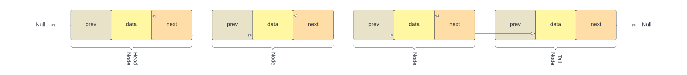
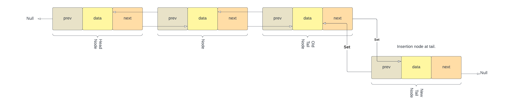
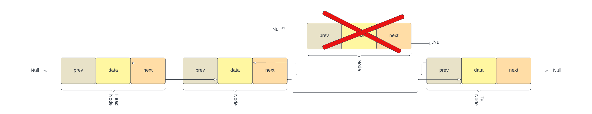
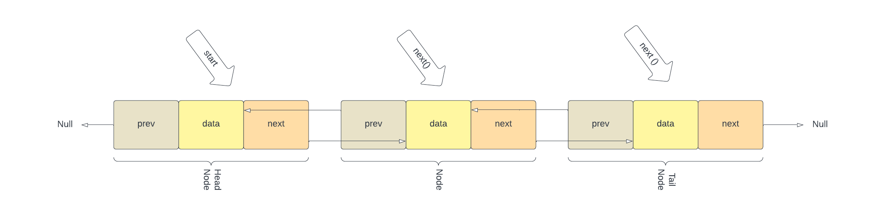

## Power of Data Structures : Linked-Lists

### Welcome to the Linked-Lists Tutorial.

- [Welcome](0-welcome.md)
- [Queue](1-Queue.md)
- [Tree](3-Tree.md)
- [Demo video COMMING SOON]<!-- add youtube link for Queue tutorial -->

# III. Linked List: Exploring Your Music

## Introduction to Linked Lists
In computer science, a linked list is a linear collection of data elements, referred to as nodes, each pointing to the 
next node by means of a pointer. It's a data structure consisting of a group of nodes which together represent a sequence. 
In its most basic form, each node contains: data, and a reference (in other words, a link) to the next node in the sequence.
Unlike arrays, linked lists are not stored in consecutive memory locations. They are scattered across memory and linked together using pointers. This gives them the dynamic ability to grow and shrink during the execution of a program.
Linked lists offer a dynamic data structure to store an ordered list of elements.



In the context of a music player, linked lists could be used to move forward or backwards through our playlist while also allowing
adding or removal of any song request anywhere in the linked list.
Linked lists allow efficient insertions and deletions of the nodes in a list.

## Common Linked-List Operations and Efficiency
Linked lists are excellent for several reasons:
* `Insertion`: Adding a song is easy. We just need to create a new node and adjust the references of neighboring nodes. 
This operation has a time complexity of O(1).

    1. Create a new node and set its Song property to the song you want to add.
    2. Traverse the linked list to reach the desired node (the node where the Next property is where you want to insert the new node.).
    3. Check the desired nodes next is null, if not null more do a)
       1. Set desired nodes next.previous to the newly created node, and the newly created node.next to the desired nodes next.
    4. Set the Next property of the desired node to the newly created node and the newly created nodes previous property 
       to the desired node.
  

  * This operation has a time complexity of O(1) if adding to the beginning of the list, and O(n) if adding to the end, as 
  it requires traversing all n nodes.
  


* `Deletion`: Removing a song is equally simple, where we only need to adjust the references of neighboring nodes. This 
also has a time complexity of O(1).

  1. Traverse the linked list to find the node that contains the song you want to remove.
  2. Adjust the Next property of the preceding node so that it points to the node after the one you're removing.
  3. Adjust the node previous after the one your removing to the preceding node.
  4. Allow garbage collection to remove the node you've just bypassed.

  * This operation has a time complexity of O(1) if removing from the beginning of the list, and O(n) if removing from the 
  end or the middle, as it requires traversing the list until you reach the node to remove.



* `Traversal`: Accessing elements in a linked list, however, involves a traversal from the head node. This results in a 
time complexity of O(n).

  1. Start at the Head node of the list.
  2. Follow the Next property to the next node in the list.
  3. Repeat step 2 until you reach the desired node.

  * This operation must be done in sequence, and cannot be done in parallel, so its time complexity is O(n), where n is the 
  number of elements in the list. This is slower than array access, which is O(1), but is a necessary trade-off for the 
  dynamic benefits of linked lists.
  

## Accessing a Song with Linked Lists
To access a song in a linked list, we start at the head of the list and follow the references to the desired song. 
This is typically slower than direct access methods like those provided by arrays. However, the dynamic nature of linked 
lists can provide benefits for certain applications, such as playlist manipulations.

## Example: Creating a Linked List using Node Structure (Pointers/References)
Here we create our Node class with SongNode Next and Prev.
```csharp
public class SongNode
{
    public string Song { get; set; }
    public SongNode Next { get; set; }
    public SongNode Prev { get; set; }
}
```
We can add a song to the end of the linked list be adjusting the the tail Nodes to point to the added song, thus become the new tail Node.
```csharp
public class SongLinkedList
{
    private SongNode head;
    private SongNode tail;

    public void AddSong(string song)
    {
        var newNode = new SongNode { Song = song };
        
        if (head == null)
        {
            head = tail = newNode;
            return;
        }

        tail.Next = newNode;
        newNode.Prev = tail;
        tail = newNode;
    }
```
`InsertSongAfterSong` allows us to insert a song anywhere within the playlist. This is one of the great benefits of 
listed-list over Queues.
```csharp  
    public void InsertSongAfterSong(string song, string location)
    {
        var newNode = new SongNode { Song = song };
        
        if (head == null)
        {
            head = tail = newNode;
            return;
        }
        while (current != null)
        {
            if (current.Song == location)
            {
                if(current.next == null)
                {
                    current.next = newNode;
                    newNode.Prev = current;
                }
                else
                {
                    current.next.prev = newNode;
                    newNode.next = current.next;
                    newNode.prev = current;
                    current.next = newNode;
                }

                return;
            }
            // move to the next node
            current = current.Next;
        }
        Console.WriteLine("No such song in playlist.");
        return;
    }
```
Another benefit of linked-list over Queues is that we can remove a song from anywhere within the playlist.
```csharp  
    public void DeleteSong(string song)
    {
        if (head == null)
        {
            return;
        }

        SongNode current = head;
        // while the song to be deleted in not current, loop
        while (current != null)
        {
            if (current.Song == song)
            {
                if (current.Prev != null)
                {
                    current.Prev.Next = current.Next;
                }
                else
                {
                    // current node is head
                    head = current.Next;
                }

                if (current.Next != null)
                {
                    current.Next.Prev = current.Prev;
                }
                else
                {
                    // current node is tail
                    tail = current.Prev;
                }

                return;
            }
            // move to the next node
            current = current.Next;
        }
    }
}
```
## Problem to Solve: Setting the playlist to loop
Imagine you have created the ultimate playlist for your workout, however the playlist has only a small handful of songs,
and your workout will last far longer then the entire playlist. You dont want to have to pull your phone out and restart
the play list, so you think up of a brilliant idea to just loop the play list.

Using the following C# script edit the SetLoop method that when called will set the linked-list to loop the entire list
or disable the loop depending on its parameter.

```csharp
public class SongNode
{
    public string Song { get; set; }
    public SongNode Next { get; set; }
    public SongNode Prev { get; set; }
}

public class SongLinkedList
{
    private SongNode head;
    private SongNode tail;
    private bool isLooped;

    public void AddSong(string song)
    {
        var newNode = new SongNode { Song = song };

        if (head == null)
        {
            head = tail = newNode;
            return;
        }

        tail.Next = newNode;
        newNode.Prev = tail;
        tail = newNode;

        if(isLooped) // If playlist is set to loop, connect tail to head
        {
            tail.Next = head;
        }
    }

    public void SetLoop(bool enable)
    {
        // The SetLoop function will receive a boolean argument enable, which signifies whether the user wants to enable 
        // or disable the looping of the playlist.
        // First you will want to store the value of enable in your isLooped class variable. 
        // Write an if-else condition. Depending on whether enable is true (the playlist should loop) or false (the playlist should not loop).         
        // If enable is true, set up the looping in your linked list. This involves connecting the Next property of the tail node to the head node.   
        // If enable is false, "break" the loop, returning the linked list to its normal state.
        // Remember to remove the line throw new NotImplementedException(); once you have implemented the SetLoop function. 
        throw new NotImplementedException();  // Remove this line after implementing the function
    }
}
```


<details>
  <summary>Solution</summary>

```csharp
public class SongNode
{
    public string Song { get; set; }
    public SongNode Next { get; set; }
    public SongNode Prev { get; set; }
}

public class SongLinkedList
{
    private SongNode head;
    private SongNode tail;
    private bool isLooped;

    public void AddSong(string song)
    {
        var newNode = new SongNode { Song = song };

        if (head == null)
        {
            head = tail = newNode;
            return;
        }

        tail.Next = newNode;
        newNode.Prev = tail;
        tail = newNode;

        if(isLooped) // If playlist is set to loop, connect tail to head
        {
            tail.Next = head;
        }
    }

    public void SetLoop(bool enable)
    {
        isLooped = enable;
        if (enable)
        {
            if(tail != null)
            {
                tail.Next = head; // Make it circular
            }
        }
        else
        {
            if(tail != null)
            {
                tail.Next = null; // Break the circle
            }
        }
    }
}
```
</details>

- [Solution Link](LinkList.cs)
- [Continue to Trees](3-Tree.md)
